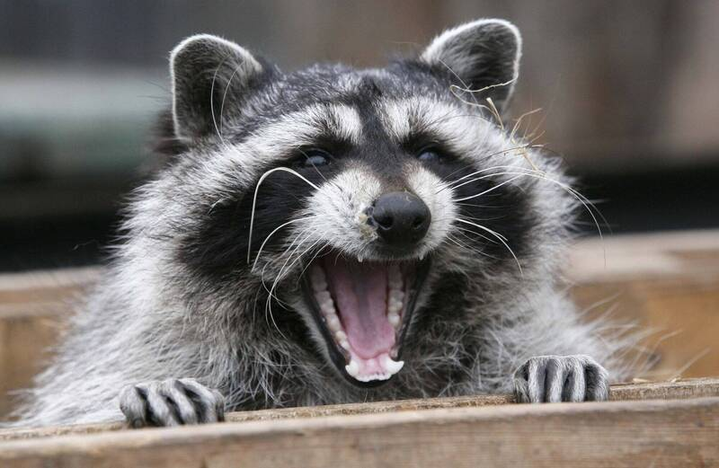

# DDPM [Denoising Diffusion Probabilistic Models](https://arxiv.org/abs/2006.11239) Pytorch Coding Tutorial

> The coding tutorial is from [YouTube](https://www.youtube.com/watch?v=S_il77Ttrmg&t=307s)

- `ddpm_adding_noise_steps.ipynb`: Show the forward part for DDPM which is adding noise

- `ddpm.ipnb`: Show the forward and backward parts for DDPM, the noise predictor is a U-Net

- Using image RACCOON

